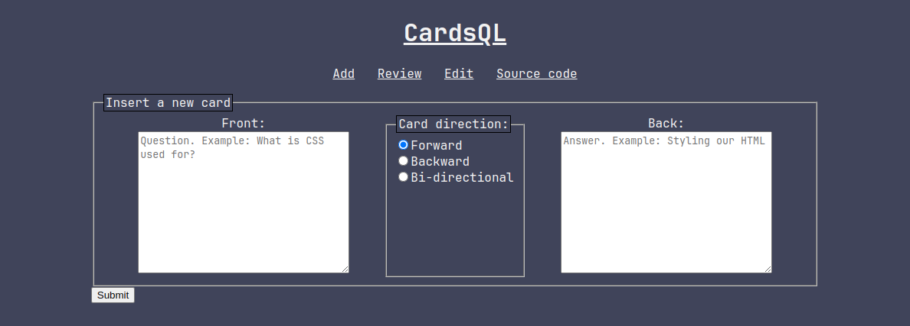
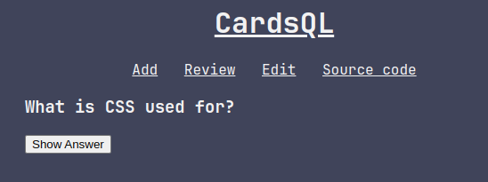
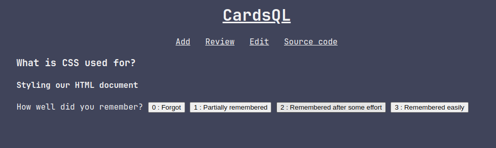
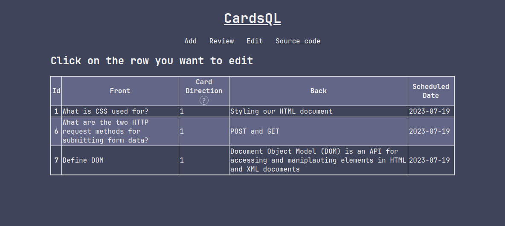
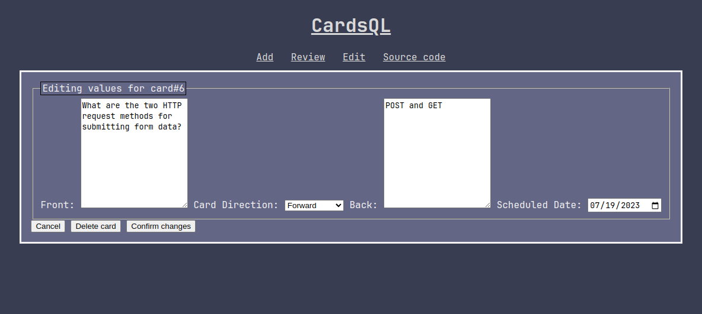

Submission for my BCA 4th sem project. The project report can be [found here](https://github.com/dinesh-58/college-files/blob/main/4th-sem/project-1/final-report/final-report.org) if you want an explanation of what this does.

## Requirements  
- php (Windows users may require some additional steps. See [here](https://www.php.net/manual/en/sqlite3.installation.php))
- sqlite
- php-sqlite

## Usage   
Find your `php.ini` file. Located in `/etc/php/` on Linux.
Uncomment the line `extension=pdo_sqlite`.
You may also want to enable error display when developing, like so: 
```ini
display_errors = On
display_startup_errors = On
```

``` sh
git clone https://github.com/dinesh-58/cardsQL.git
cd cardsQL
php -S localhost:8000
sqlite3 cardsql.db < commands.sql  # create required db file & tables
```
Then, open `localhost:8000` in your browser.

## Screenshots
### Add/Home Interface

### Review/practice cards Interface


### Edit cards Interface


